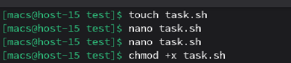
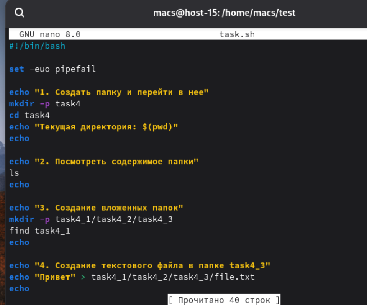
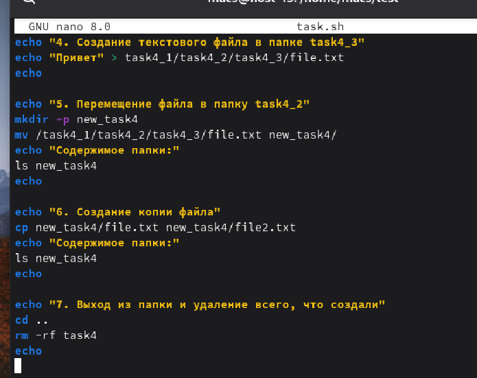
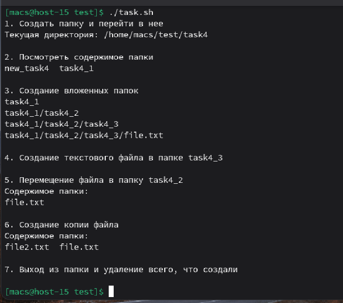

#### 1. Что такое шебанг?

Шебанг — это последовательность из символов решетки и восклицательного знака **#!** в самом начале текстового файла скрипта. После этих символов указывается полный путь к интерпретатору, который должен исполнить данный код. Например: **#!/bin/bash**

#### 2. Обязательно ли исполняемый файл дожен иметь соотвествующее расширение?

Нет, не обязательно. В Linux расширение файла носит чисто информативный характер для пользователя, чтобы было легче понять тип контента

#### 3. Напишите скрипт который выполнит автоматически действия из блока работы с файлами. ( не забудьте включить set -euo pipefail для того что бы ваш скрипт было удобнее отлаживать. Опишите что включают эти флаги)

Для начала создаем файл **task** с расширением **.sh**. C помощью утилиты **nano** запишем скрипт в файл **task**. В начало файла добавим шебанг **#!/bin/bash**, указывающий системе на интерпретатор команд

С помощью команды **chmod +x task.sh** сделаем файл исполняемым и командой **./task.sh** запустим его

В начале кода прописана команда **set -euo pipefail**

**-e** — остановит скрипт, если любая команда упадет

**-u** — выдаст ошибку, если в коде есть несуществующая переменная

**-o pipefail** — поймает ошибку, если она произойдет внутри конвейера

