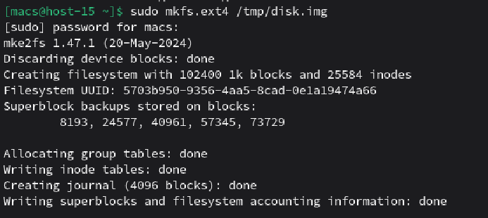
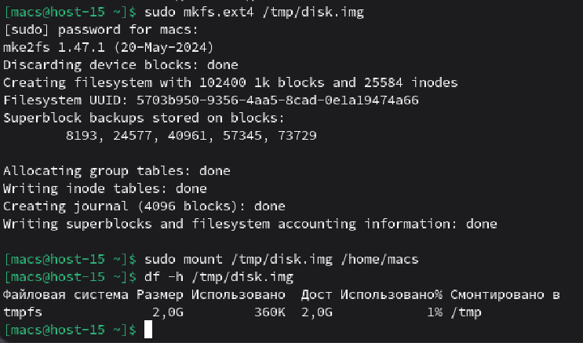
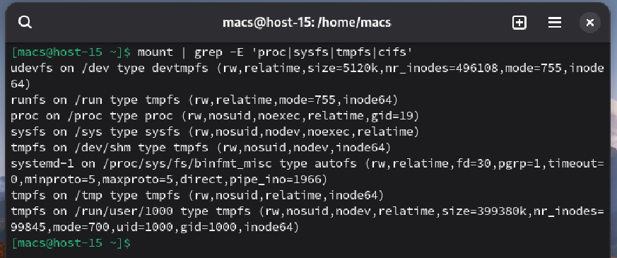
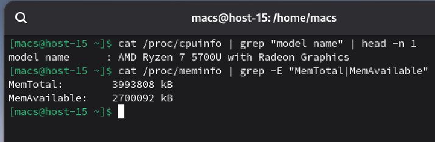

#### 1. Какие файловые системы вы знаете?

**Windows**: NTFS, FAT32, exFAT
**Linux**: Ext4, XFS, Btrfs
**Apple**: APFS, HFS

#### 2. Как можно классифиировать файловые системы? в чём отличия??

Файловые системы классифицируются по способу организации данных:

 1. **По назначению:** Дисковые, сетевые и виртуальные.

 2. **По методу записи:** Журналируемые (Ext4, NTFS) — записывают изменения в журнал перед выполнением, что предотвращает повреждение данных при сбое; и нежурналируемые (FAT32).

 3. **По структуре:** Иерархические и объектные.

**Отличия:** заключаются в максимальном объеме тома, скорости работы с мелкими/крупными файлами и поддержке прав доступа

#### 3. Какие файловые системы используются в linux?

В современных дистрибутивах Linux чаще всего используются:

* **Ext4:** Самая стабильная и универсальная

* **XFS:** Высокопроизводительная, хорошо работает с файлами больших размеров

* **Btrfs:** Современная ФС с поддержкой снимков (snapshots) и сжатия

#### 4. Как можно создать файловую систему на диске?

Файловая система создается на подготовленном разделе диска с помощью утилит семейства **mkfs**.

Создадим файловую систему по пути /tmp/disk.img

#### 5. Как можно подключить диск в систему, что такое монтирование?

**Монтирование** - это процесс логического связывания корневой файловой системы с файловой системой на конкретном устройстве

Для начала создаем точку монтирования, дальше монтируем по указанному пути и проверяем результат. Для этого используем команды **mkfs.ext4** для создания новой файловой системы, далее **mount** для монтирования ее и **df -h** для просмотра информации.

#### 6 Файловая система procfs, cifs, tpmfs,sysfs. В чём особенности каждой из них?
Вывести каталоги к которым примонтированы эти файловые системыю

**Особенности систем:**
* **procfs:** Содержит информацию о состоянии процессов и параметрах ядра

* **sysfs:** Отображает иерархию устройств, драйверов и настроек оборудования

* **tmpfs:** Использует оперативную память для хранения временных данных. Очень быстрая, но данные теряются при перезагрузке

* **cifs:** Протокол для монтирования сетевых папок Windows

Исходя из выводов команд можем увидеть, что:

**procfs** примонтирована к **/proc**
**sysfs** примонтирована к **/sys**
**tmpfs** примонтирована к **/tmp**, **/run**, **/dev/shm**, **/run/user/1000**

**cifs** не представлена, так как на данный момент нет сетевых подключений

#### 7. Как можно получить информацию о системе используя лишь команду cat?
вывести ифонмацию о процессоре и состоянии памяти системы

Для вывода информациио процессоре воспользуемся командой **cat /proc/cpuinfo**

Для вывода информации о памяти системы используем команду **cat /proc/meminfo**

**grep** - утилита, производящая поиск строк по определенному шаблону

