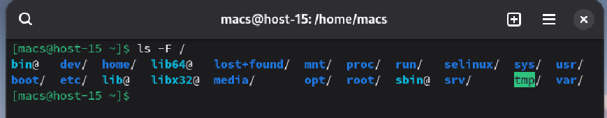
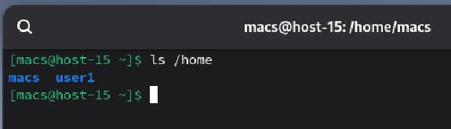
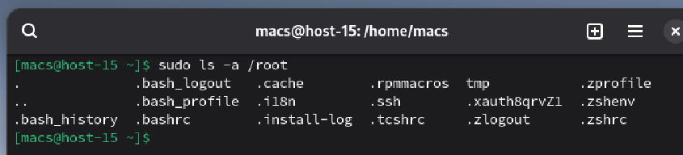
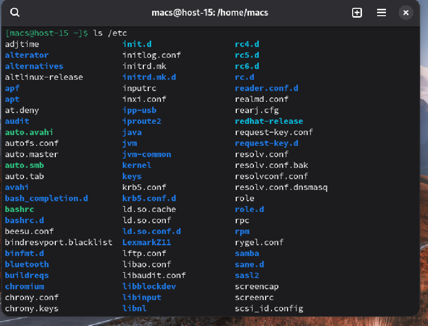

#### 1. Какая структура каталогов в linux? выведите список файлов в корне системы

Структура каталогов Linux является иерархической и начинается с корневого каталога **root**, обозначаемого символом **/**. В отличие от Windows, здесь нет разделения на логические диски; все физические разделы и устройства монтируются в определенные точки этой единой структуры

Для вывода списка всех файлов воспользуемся командой **ls -F /**

#### 2. Где хранятся папки пользователей в системе?

Каталог **/home** предназначен для хранения личных данных пользователей (документы, настройки приложений, рабочий стол). Для каждого обычного пользователя создается отдельная подпапка, например **/home/user1**

#### 3. Где домашняя папка суперпользователя?

Домашний каталог суперпользователя **root** вынесен отдельно от остальных пользователей и находится в **/roo**t. Это сделано для того, чтобы администратор мог войти в систему и иметь доступ к своим настройкам даже в случае, если раздел **/home** не удалось примонтировать

Для просмотра каталога суперпользователя воспользуемся командой **sudo ls -a**

#### 4. Где хранятся основые конфигурационные файлы в системе?

Каталог /etc содержит все системные конфигурационные файлы. Здесь хранятся настройки паролей **/etc/passwd**, настройки сети, списки репозиториев и параметры работы системных служб

#### 5. Что за папки /bin,/sbin,usr/sbin,/usr/sbin?

**/bin** 

Содержит фундаментальные команды, которые необходимы для работоспособности системы даже в тех случаях, когда другие разделы диска еще не примонтированы. Здесь находятся такие инструменты, как **ls**, **cp**, **cat** и оболочка **bash**. Эти команды доступны всем пользователям системы и критически важны для восстановления ОС в аварийных ситуациях.

**/sbin**

Предназначена для хранения важных утилит системного администрирования. В отличие от **/bin**, здесь располагаются программы, которые обычно может запускать только суперпользователь root, так как они напрямую влияют на работу оборудования и управление всей системой. Примерами таких программ являются **fdisk** (для разметки дисков), **reboot** (для перезагрузки) и **ifconfig** или **ip** (для настройки сети).

**/usr/bin**

Является основным местом хранения для большинства пользовательских программ и инструментов, которые не являются критически важными для самого процесса загрузки ядра. Здесь находятся прикладные программы, установленные через пакетный менеджер, такие как **python**, **git**, **gcc** или текстовые редакторы. Эти файлы доступны всем пользователям для повседневной работы.

**/usr/sbin** 

Cодержит программы для системного администрирования, которые не требуются для минимального функционирования системы в однопользовательском режиме. Здесь чаще всего располагаются **sshd** (сервер удаленного доступа) или **tcpdump** (анализатор сетевого трафика). Как и в случае с обычной папкой **sbin**, работа с этими файлами чаще всего требует прав администратора.

