#### 1. Выведите содержимое fstab. Что хранится в fstab?

Файл **/etc/fstab** — это конфигурационный файл, в котором хранится информация о файловых системах, которые должны автоматически монтироваться при загрузке системы. Каждая строка содержит путь к устройству, точку монтирования, тип файловой системы, параметры монтирования и флаги для проверки диска.

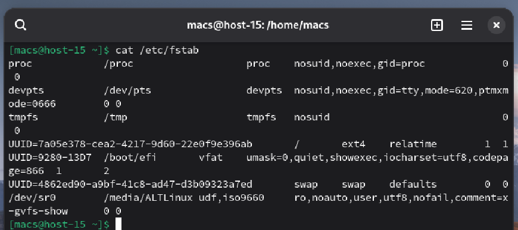

#### 2. Добавьте в виртуальную машину ещё один диск

Добавил диск sdb на 2гб

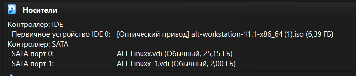

#### 3. Узнайте как ситема видит ваш диск - выведите информацию о блочных устройствах

Для вывода информации о блочных устройствах воспользуемся командой **lsblk**

Команда lsblk выводит список всех блочных устройств. Новый диск обычно отображается как sdb и не имеет привязанных точек монтирования.

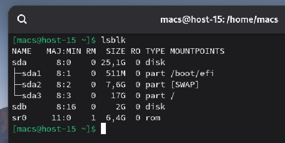

#### 4. С помощью полученной информации создайте на диске таблицу разделов и фаловую систему ext4

Для начала создадим таблицу разделов с помощью **sudo parted**

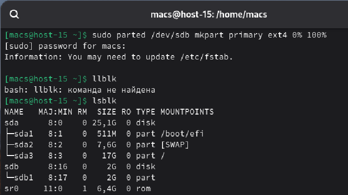

Далее с помощью команды **sudo mkfs.ext4** создадим файловую систему в новом разделе диска

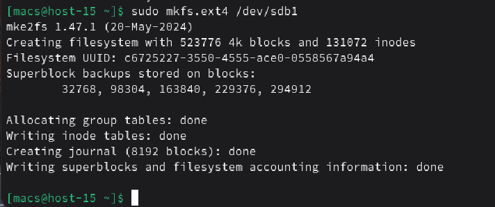

#### 5. Примонитруте диск в каталог /mnt

Далее с помощью команды **sudo mount** примонтируем диск в каталог

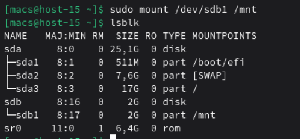

#### 6. Зайдите в каталог и создайте там файлы

В каталоге **/mnt** создадим папку **test** и 2 файла: **file1.txt** и **file2.txt** 

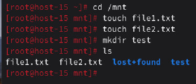

#### 7. Отмонтируйте диск и проверье остались ли файлы

Для начала отмонтируем диск с помощью команды **sudo umount -l**
Далее проверим содержимое диска

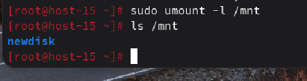

После **umount** каталог **/mnt** станет пустым. Это доказывает, что данные находятся на внешнем диске, а не в корневой системе **/**

#### 8. Сделайте так, чтобы диск автоматически подключался при загрузке систем ( добавьте информацию о нём с fstab)

Для начала с помощью команды **blkid** узнаем UUID нашего диска.

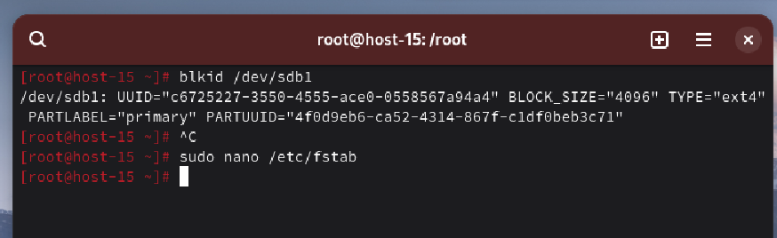

Далее с помощью редактора **nano** изменим информацию в **fstab**

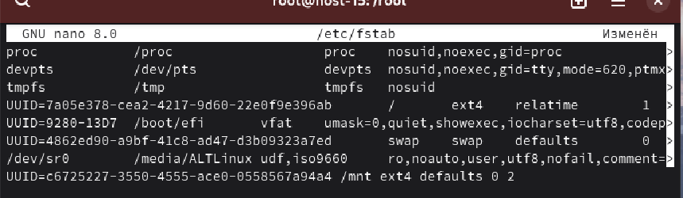

#### 9. Проверьте корретность записанных в fstab данных перед перезагрузкой

Для проверки воспользуемся командой **sudo mount -a**

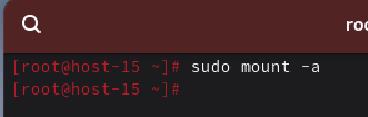

Команда **mount -a** заставляет систему примонтировать всё, что написано в fstab.

#### 10. Перезагрузите систему и убедитесь что диск был подключён к системе

Перезагрузим систему с помощью команды **sudo reboot** и с помощью команд **lsblk** и **ls /mnt** проверим, был ли подключен диск к системе

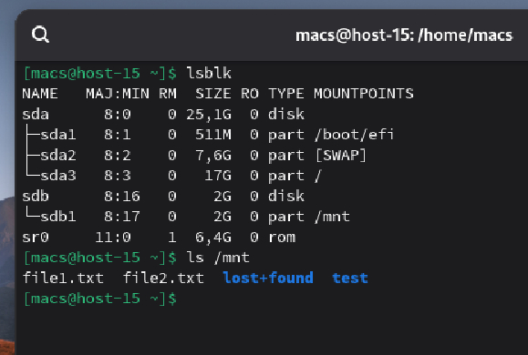

После перезагрузки мы видим, что диск sdb1 автоматически примонтирован к /mnt и наши файлы снова на месте