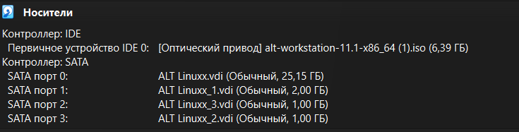
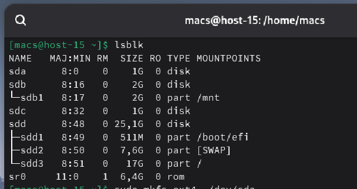
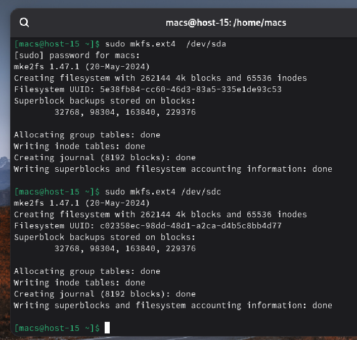
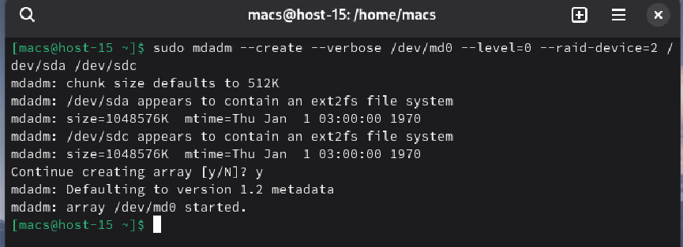
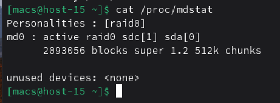
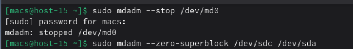
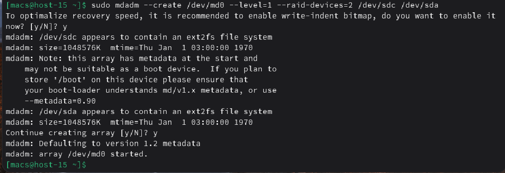
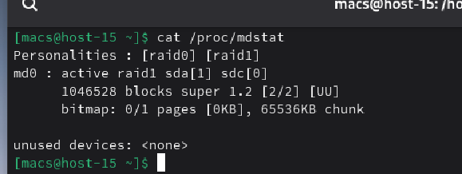

#### 1. Raid массивы, что такое икакие бывают

**RAID массивы** — это технология виртуализации данных, которая объединяет несколько дисков в один логический модуль. Это нужно для повышения отказоустойчивости или увеличения производительности

RAID 0: Данные разбиваются на части и пишутся на все диски одновременно. Очень быстро, но если вылетит один диск — погибнут все данные.

RAID 1: Данные дублируются на оба диска. Очень надежно: если один диск сгорит, второй продолжит работать.

RAID 5: Чередование с контролем четности. Минимум 3 диска. Хороший баланс скорости и надежности.

RAID 10: Комбинация. Высокая скорость и высокая надежность.

#### 2. Добавьте в виртуальную машину 2 диска отформатируйте их в ext4

Для начала создадим 2 новых диска размерностью по 1гб каждый

Диски создались с именами **sdc** и **sda**

Отформатируем их в ext4 с помощью команды **mkfs.ext4**

#### 3. Создайте из них raid 0 массив

Создадим raid 0 массив

Команда **--create** создает новое устройство **/dev/md0**. Параметр **--level=0** указывает на тип **Striping**. Данные будут «размазываться» по обоим дискам, суммируя их объем и скорость.

#### 4. Проверьте всё ли работает

Для проверки воспользуемся командой **cat /proc/mdstat**

#### 5. Удалите raid0 и создайте raid1

Для перехода от RAID 0 к RAID 1 необходимо сначала полностью остановить текущий массив и очистить суперблоки на дисках, чтобы система больше не воспринимала их как части старого массива. Далее выполняется создание нового массива с флагом **--level=1**. В этом режиме диски работают по принципу «зеркалирования», где на второй диск записывается полная копия первого

#### 6. В чём между ними разница?

Основная разница заключается в целях использования:

**RAID 0** суммирует объем дисков и значительно увеличивает скорость записи и чтения, так как данные пишутся на оба диска параллельно. Однако он не имеет отказоустойчивости — выход из строя любого диска уничтожает все данные.

**RAID 1** не увеличивает объем, так как данные дублируются. Его главная цель — надежность. При поломке одного из дисков система продолжает работать без потери информации.

#### 7. Есть ли файловые системы которые поддерживают raid массивы без стороненго ПО

В современных ОС Linux существуют файловые системы «нового поколения», которые имеют встроенный функционал управления дисковыми массивами, исключая необходимость использования **mdadm** или **аппаратных контроллеров**. Самыми известными являются **ZFS** и **Btrfs**. Они позволяют объединять диски в пулы, выполнять зеркалирование и проверку целостности данных на уровне самой файловой системы

#### 8. Можно ли создать raid массив во время установки системы?

Да, создание RAID-массива возможно непосредственно на этапе установки операционной системы. Большинство серверных дистрибуторов включают в программу установки инструмент управления разделами, позволяющий объединить физические диски в программный RAID. Это часто используется для того, чтобы установить саму операционную систему на отказоустойчивый зеркальный массив RAID 1

