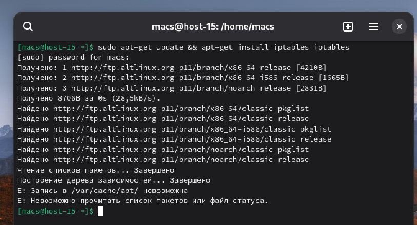
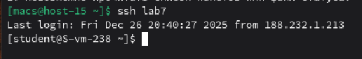
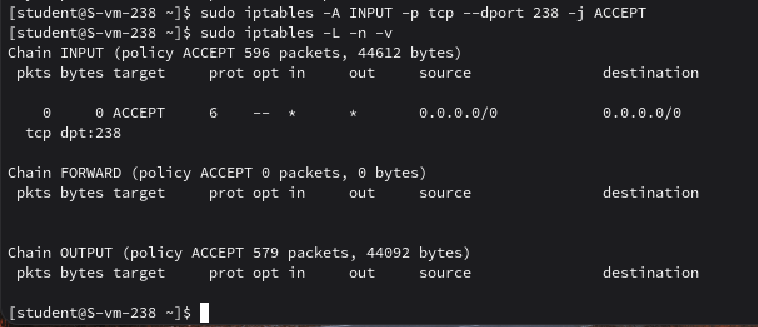
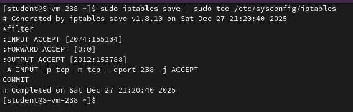

#### 1. Установите iptables

Установил

#### 2. Проверьте осталась ли возможность подключения по ssh к вашему серверу

Возможность подключения по ssh осталась

#### 3. Почему может пропасть такая возможность?

Доступ пропадает, если в iptables устанавливается политика по умолчанию DROP или добавляется правило, запрещающее входящий трафик на порт SSH

#### 4. Откройте нужный порт на сервере чтобы восстановить подключение

Будем открывать порт **238**. Для этого с помощью **-A INPUT** добавим правило в цепочку входящий пакетов, далее с помощью **--dropt 238**  укажем порт для подключения и **-j ACCEPT** разрешим проход

#### 5. Это будет udp или tcp прот?

**TCP**. Для SSH всегда используется протокол TCP.

#### 6. Сохраняются ли записанные вами правила после перезагрузки?

Нет, по умолчанию правила iptables активны только в оперативной памяти. Если сервер перезагрузится, все ACCEPT и DROP обнулятся

#### 7. Как их сохранить?

Сохраним правила с помощью команды **iptables-save** в директорию **/etc/sysconfig/iptables**

