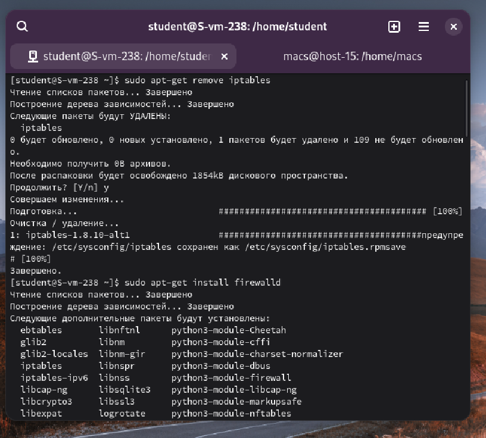
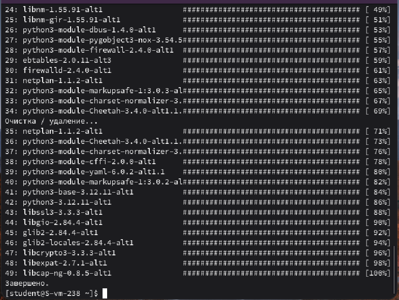
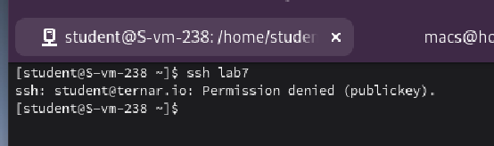
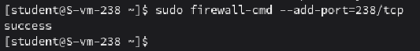
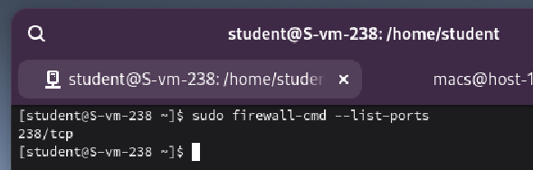
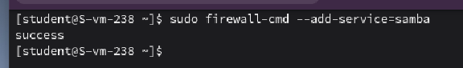
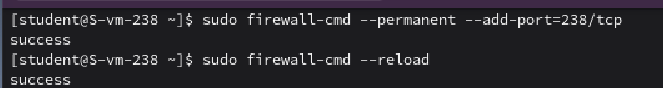
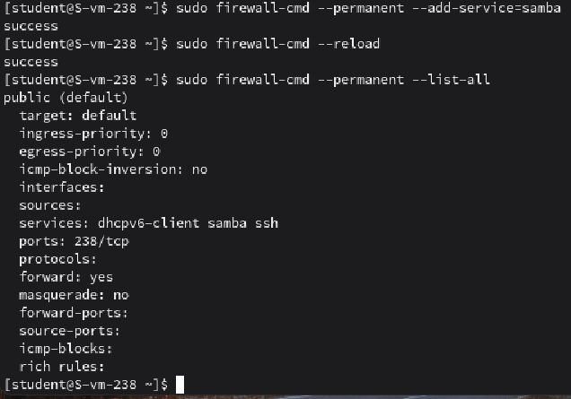

#### 1. Удалите iptables и установите firewalld

Удалили iptables с помощью команды **remove** и установили **firewalld**

#### 2. Попробуйте так-же проверить возможность подключения по ssh

Не получилось подключиться по ssh

#### 3. Если её нет то откройте порт

Добавил порт **238** с помощью команды **--add-port=238/tcp**

#### 4. Выведите список открытых портов с помощью firewall-cmd

Для отображения списка портов воспользуемся командой **--list-ports**

#### 5. Можно ли там добавить порты по названию сервиса?

Да, можно. Для этого воспользуемся командой **sudo firewall-cmd --add-service=** Например, для SSH это выглядит так:

**sudo firewall-cmd --add-service=ssh**

#### 6. На вашей Локальной виртуальной машине попробуйте подключиться к серверу samba из предыдущих заданий

Не получается, так как не открыты нужные порты

#### 7. Если не получилось то откройте нужные порты

Открыли все нужные порты для подключения

#### 9. Сделайте так чтобы изменения были постоянными

Для того, чтобы изменения были постоянными добавим ключ **--permanent** и перезагрузим правила с помощью **reload**

