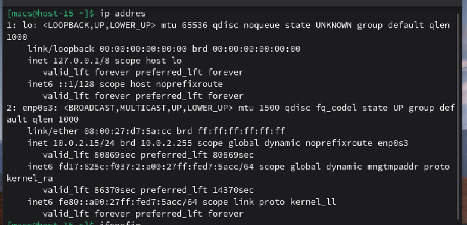
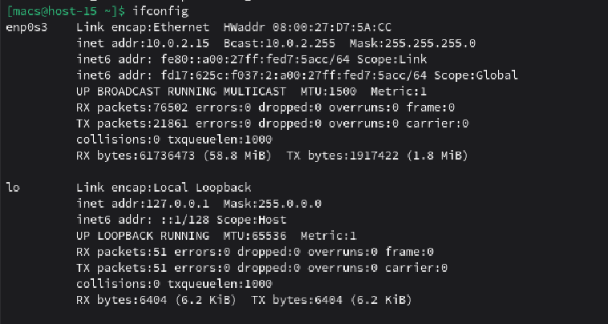
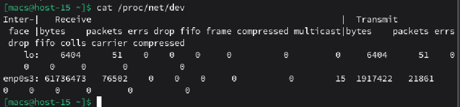
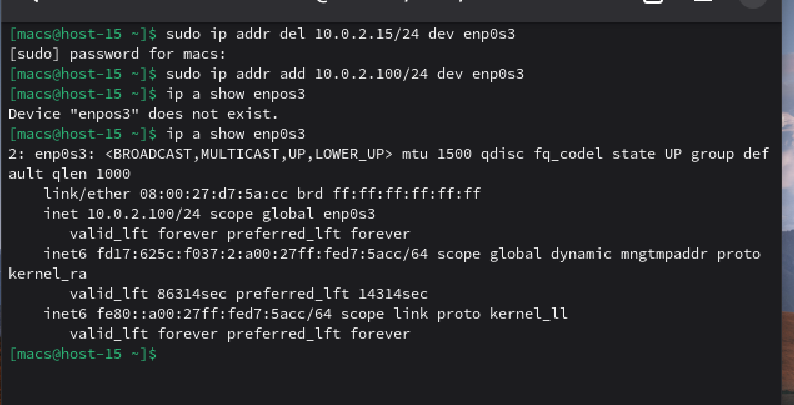
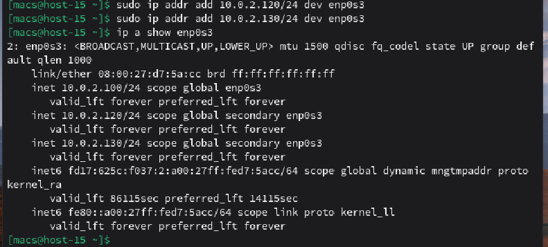
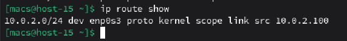
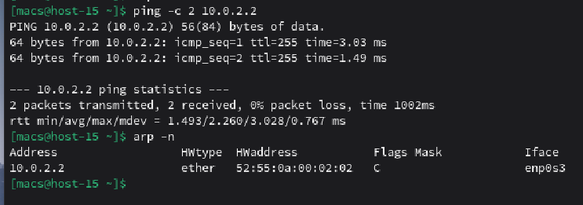

#### 1. Выведите список интерфейсов, какими способами можно это сделать?

Для просмотра списка интерфейсов можно воспользоваться несколькими способами:

Команда **ip addres**

Команда **ifconfig**

Просмотр содержимого системного файла **/proc/net/dev**

#### 2. Попробуйте изменить ip адрес

Изменим ip адрес, для этого сначала удалим старый ip адрем, потом создадим новый и проверим резльтат выполнения команд **addr** и **addr del**

#### 3. Попробуте добавить несколько ip адресов на сетевую карту

Добавим еще несколько ip адресов и проверим их наличие

#### 4. Выведите список маршрутов

Выведем список маршрутов с помощью команды **ip route show**

#### 5. Выведите arp таблицу

Для вывода arp таблицыы воспользуемся командой **arp -n**. Изначально таблица пуста, поэтому мы делаем **ping** для того, чтобы принудительно наполнить ARP-таблицу актуальными данными

#### 6. Что такое ip адрес?

**IP адрес**  - это уникальный числовой идентификатор устройства в сети, работающей по протоколу IP. Он необходим для обмена пакетами данных

#### 7. Для чего нужны маршруты?

Маршруты указывают операционной системе, через какой шлюз отправлять пакет, если цель находится вне текущей локальной сети. Без таблицы маршрутизации компьютер не сможет выйти в интернет

#### 8. Что за протокол arp?

**ARP** — протокол, который связывает IP-адрес с MAC-адресом

#### 9. Что такое dhcp?

**DHCP** — протокол автоматической настройки сети

#### 10. Что такое dns?

**DNS** - это система, превращающая доменные имена сайтов в понятные машинам IP-адреса

#### 11. Как называется один из протоколов синхронизации времени?

NTP или его упрощенная версия SNTP.

#### 12. Что такое широковещательный запрос, зачем он нужен?

**Широковещательный запрос** - это отправка пакета данных всем устройствам в текущем сегменте сети одновременно

#### 13. Какой адресс является широковещательным?

Локальный: 255.255.255.255

#### 14. Какие ещё параметры можно задать сетевой карте?

* **MTU** — максимальный размер пакета
* **MAC-адрес** — это уникальный физический идентификатор, присваиваемый производителем каждому сетевому устройству 
* **Duplex/Speed** — скорость и режим передачи.
* **Маска подсети**
и др.

#### 15. Что такое маска подсети? зачем она нужна?

**Маска подсети** - это число, которое определяет, какая часть IP-адреса относится к адресу всей сети, а какая — к адресу конкретного устройства

Маска подсети нужна для: разделения адреса на сеть и хост, определения маршрута, создания иерархии и экономии адресов