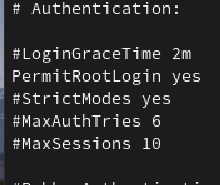
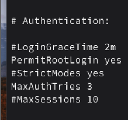
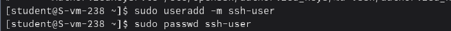
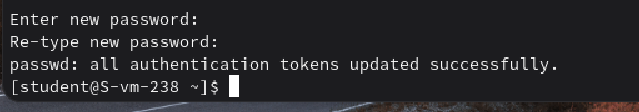
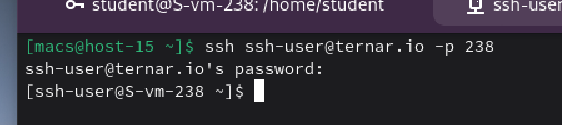
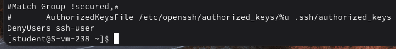

#### 1. Какой по умолчанию используется порт для поключения?

По умолчанию для протокола SSH используется порт **22**.

#### 2. Можно ли его изменить? если да то как?

Да, порт изменить можно. Для этого нужно отредактировать файл конфигурации сервера и изменить число 22 на нужное

#### 3. Какая служба отвечает за обработку запросов на подключения по ssh?

За это отвечает демон под названием sshd

#### 4. Какой файл конфигурации отвечает за его настройку?

Основной файл конфигурации SSH-сервера находится по пути: /etc/ssh/sshd_config

#### 5. Попробуйте подключиться по ssh к предоставленному вам серверу

Подключился к серверу с помощью **ssh student@ternar.io -p 238** (номер в группе 38)

#### 6. Отредактируйте файл настроек на сервере так, чтобы была возможность подключиться к серверу используя пользователя root

Изменил в файле **/etc/openssh/sshd_config** параметр **PermitRootLogin**

#### 7. Измените колличество ошибок ввода пароля перед сборосом соединения, покажите эти измененения

В том же файле изменил параметр **MaxAuthTries**

#### 8. Создайте пользователя ssh-user и попробуйте им подключиться к серверу

Создал пользователя и установил для него пароль

Зашел на сервер под новым пользователем

#### 9. Ограничте ему возможность подключения к серверу

Ограничил пользователю возмоможность подключения

#### 10. Как вы это сделали?

В конец файла **/etc/openssh/sshd_config** добавил строку **DenyUsers ssh-user**

#### 11. Что хранится в файле known_hosts?

В нем хранятся публичные ключи всех серверов, к которым пользователь когда-либо подключался.
