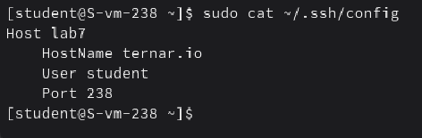
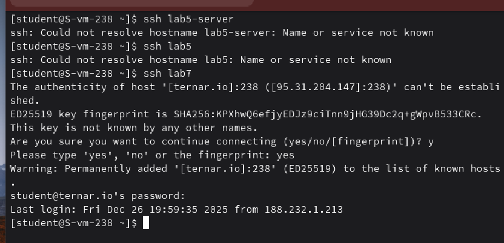

#### 1. Где хранятся пользвательские и системные настройки подключения?

**Системные:** /etc/ssh/ssh_config

**Пользовательские:** ~/.ssh/config

#### 2. Что за файл options?

Это конфигурационный файл клиента, где прописываются парамметры подключения

#### 3. Отредактируйте файл options так, чтобы можно было подключаться не вводя имя пользвателя и порт

С помощью vi записал в файл ~/.ssh/config информацию о сервере

#### 4. Назовите подключение удобным для вас спсобом

Назвал хост **lab7**

#### 5. Проверьте работоспособность

Проверил работоспособность

