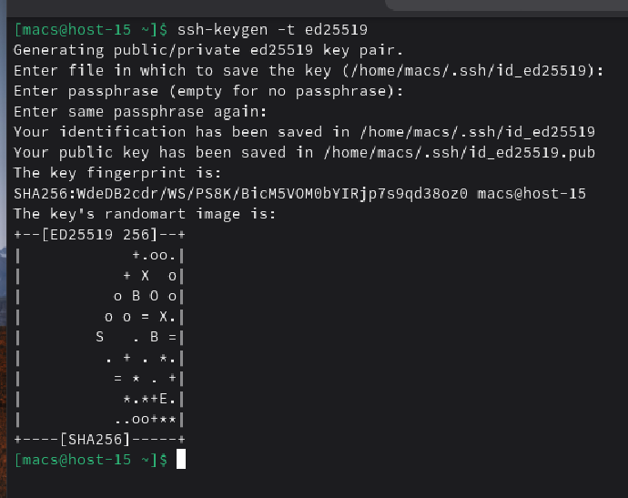
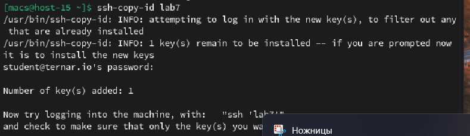
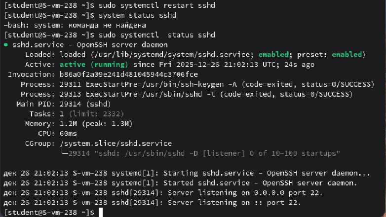

#### 1. Что такое ssh ключи и зачем они нужны?

**SSH-ключи** — это пара криптографических ключей, которая используются для аутентификации вместо пароля.

Они намного надежнее паролей, так как их практически невозможно подобрать. К тому же, они позволяют входить на сервер автоматически, что удобно для скриптов и быстрой работы

#### 2. Как их создать? 

Ключи создаются специальной утилитой **ssh-keygen**. Она генерирует два файла: один приватный у пользователя, а второй публичный отправляется на сервер

#### 3. Создайт пару публичный/приватный ключ ed_25519, где они хранятся?

Создал пару ключей. Они хранятся в папке **~/.ssh/**

#### 4. Скопируйте публичный ключ на ваш сервер, в каком файле он будет храниться?

Скопировал ключ на сервер, он хранится в файле **/home/scriptuser/.ssh/autorized_keys**

#### 5. Попробуйте подключиться к серверу, у вас запросили пароль?

Вход теперь доступен без пароля

#### 6. Запретите подключение с паролем для всех пользователей, оставьте только с помощью ключа

Заменил в файле **/etc/openssh/sshd_config** PasswordAuthentication и PubKeyAuthentication и перезапустил сервер

