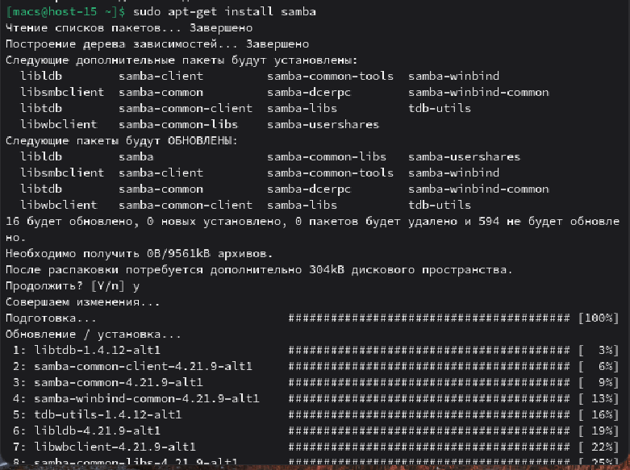
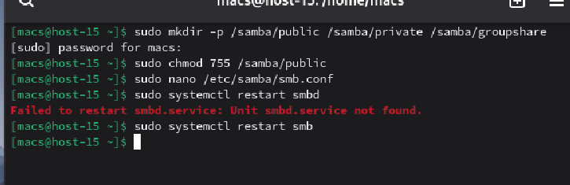
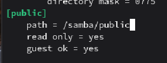
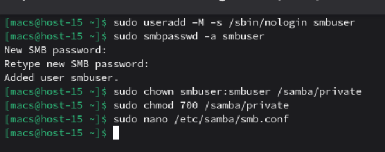
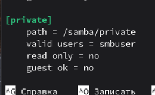
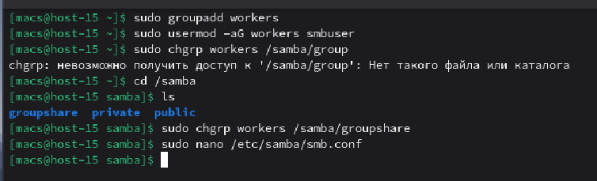
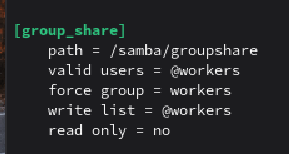
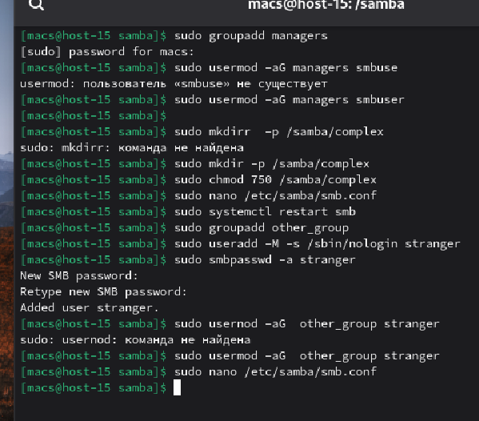
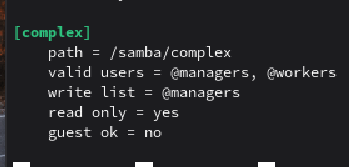

#### 1. Установите пакет samba

Установил пакет **samba** с помощью команды **apt-get install samba**

#### 2. ЧТо такое побщая папка, зачем оно может быть нужно?

**Общая папка** — это директория на сервере, к которой могут подключаться другие компьютеры через сеть

**Для чего нужна:** Для централизованного хранения файлов, обмена документами между Windows/Linux/macOS и создания бэкапов

#### 3. Создайте общую папку без пароля с правами только на чтение файлов

Создадим папки для **public**, **private** и **group** применим к паблик права для всех пользователей и только для чтения

В файле **/etc/samba/smb.conf** дописали пункт для **public**

#### 4. Создайте общую папку с паролем с правами на чтение и запись

Создал нового пользователя, задал для него пароль, обновил права доступа к папке на чтение и запись

В файле **/etc/samba/smb.conf** дописали пункт для **private**

#### 5. Создайте общую папку с доступом для какой-то группы с полными правами

Создал новую группу, добавил пользователя в эту группу, изменил владельца группы для дальнейшего объявления на чтение и запись

В файле **/etc/samba/smb.conf** дописали пункт для **group_share**

#### 6. Создайте общую папку в которой у одной группы будет полный доступ, а у другой только доступ на чтение. Третья группа не должна иметь к ней доступа

Создадим еще 2 группы **managers** и **other_group** добавим уже созданного пользователя в группу managers, и создадим новую папку **complex**. Далее обновим права на чтение и запись в данной папке. После этого создадим нового пользователя и добавим его в other_group. В итоге у группы **managers** будут права на чтение и запись, у группы **workers** только на чтение, а у группы **other_group** не будет доступа к этой папке

В файле **/etc/samba/smb.conf** дописали пункт для **complex**

