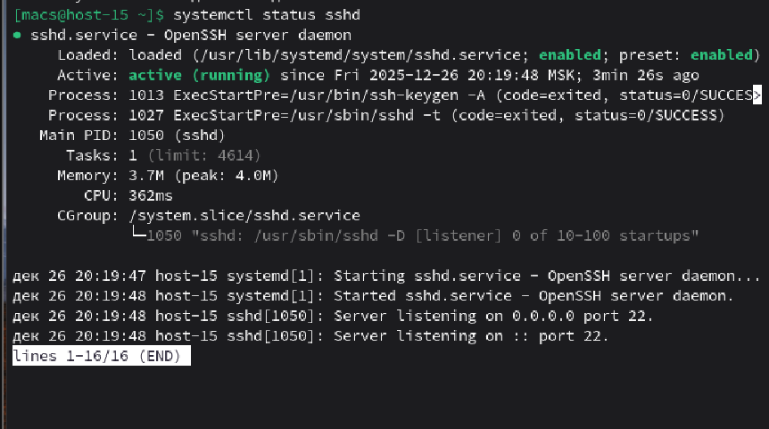
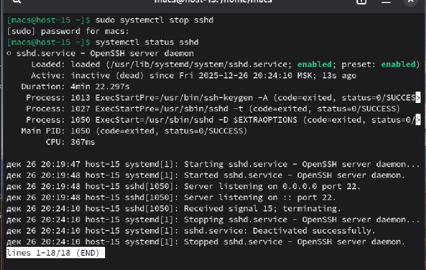
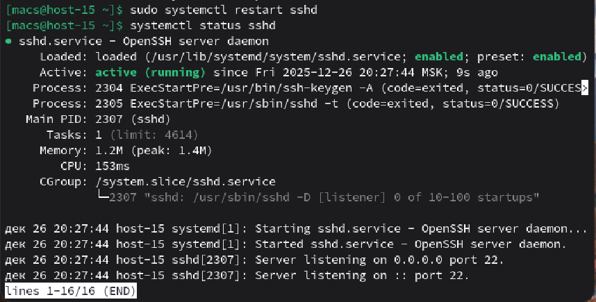
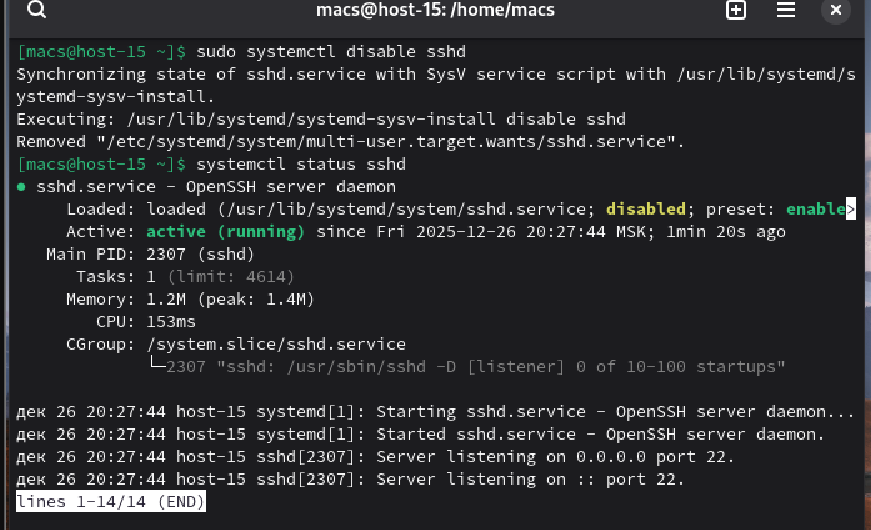
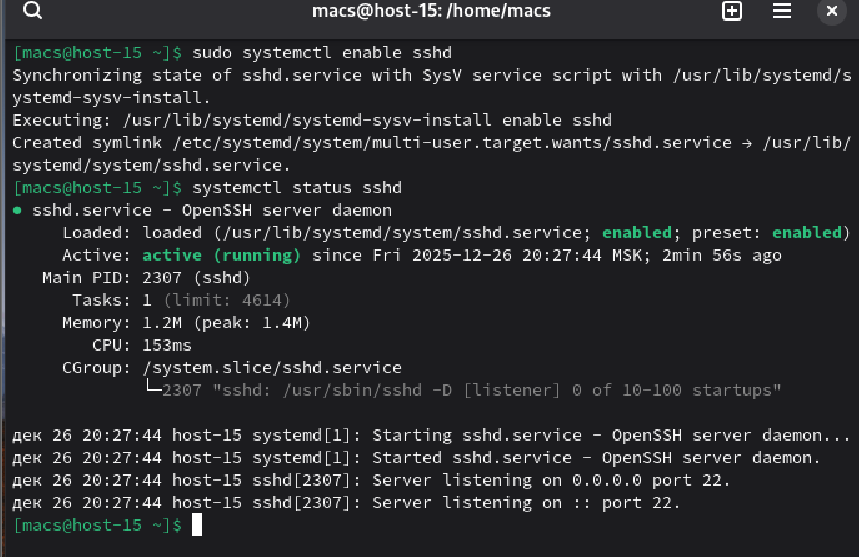

#### 1. Что такое systemd юнит?

**Systemd** — это менеджер системы и служб в Linux. Он управляет процессами с момента включения компьютера

**Systemd юнит** — это объект, которым systemd умеет управлять. Чаще всего юниты — это сервисы, но это могут быть и устройства, точки монтирования дисков или таймеры

#### 2. Проверье статус любого systemd юнита, какую информацию выводит эта кманда?

Для проверки юнита возьмем **sshd** и воспользуемся командой **status**

#### 3. ПОпробуйте оставновить сервис.

Для остановки сервиса воспользуемся командой **stop**

#### 4. Перезапустите его.

Для перезапуска воспользуемся командой **restart**

#### 5. УДалите из автозагрузки

Для удаления из автозагрузки воспользуемся командой **disable**

#### 6. Верните обратно

Для добавления в автозагрузку используем **enable**

#### 7. Что такое таймеры?

**Таймеры** — это специальные юниты-планировщики, которые запускают другие юниты по определенному расписанию или событию.