#### 1. Создайте скрипт который создаёт папку заполняет её файлами ( имена 1-4 ) и записывает в них информацию о текущей дате, версии ядра, имени компьютера и списе всех файлов в домашнем каталоге пользователя от которого выполняется скрипт( не забудьте сдлеать проверку на существование файлов и папок

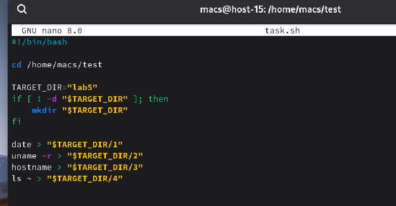

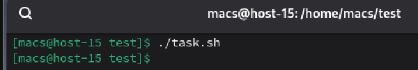

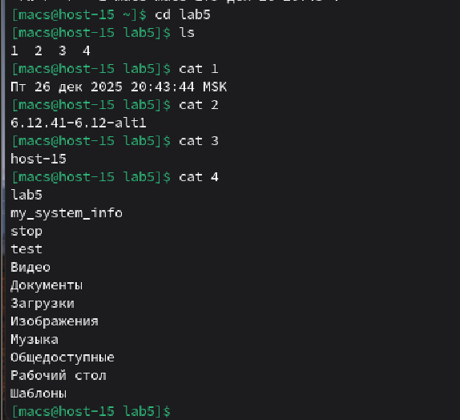

#### 2. Создайте юнит который будет вызывать этот скрипт при запуске. Проверьте

Создадим юнит и добавим в него данный код

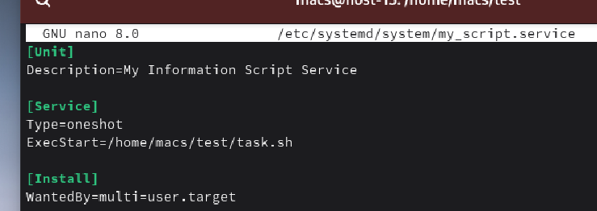

Далее с помощью **daemon-reload** установим зависимости и с помощью **start** запустим юнит

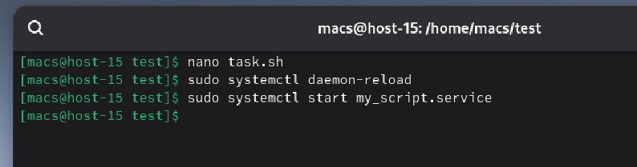

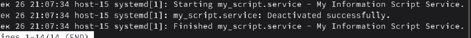

#### 3. Создайте таймер который будет вызывать выполнение одноимённого systemd юнита каждые 5 минут.

Создадим файл таймера и запишем в него скрипт

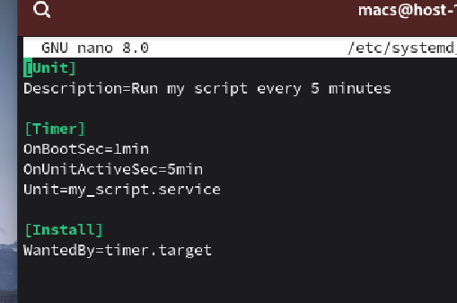

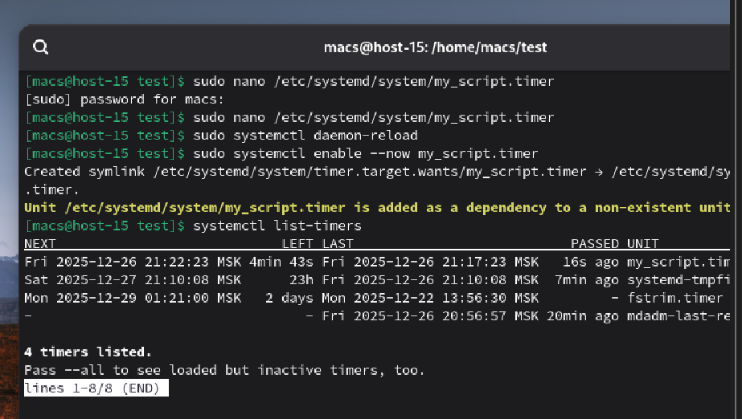

Установим зависимости, запустим таймер и проверим результат

#### 4. От какого пользователя вызыаются юниты поумолчанию?

По умолчанию системные юниты systemd выполняются от имени пользователя root

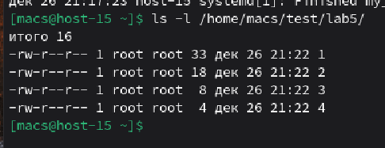

#### 5. Создайте пользователя от имени которого будет выполняться ваш скрипт

Создали пользователя с помощью **useradd**

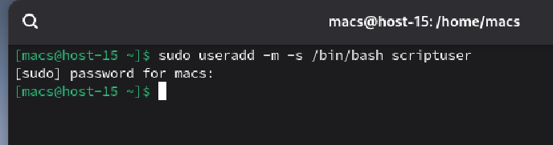

#### 6. Дополните юнит информацией о пользователе от которого должен выплняться скрипт

Изменили юнит добавив строку с указанием имени пользователя

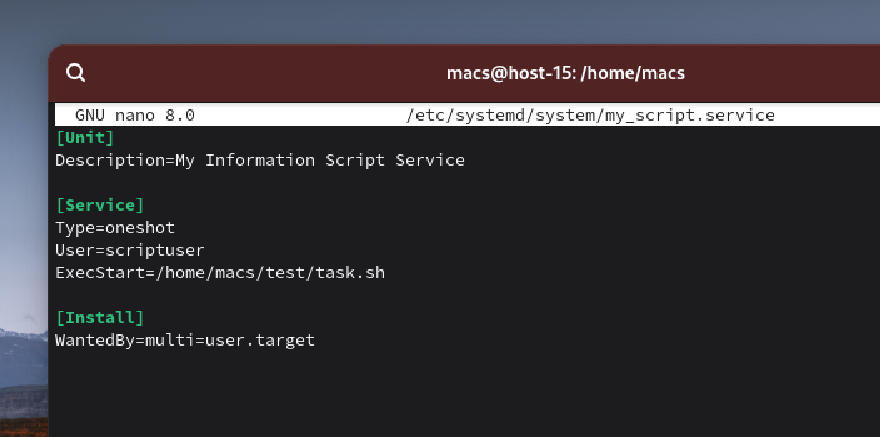

#### 7. Дополните ваш скрипт так, что бы он независимо от местоположения всега выполнялся в домашней папке того кто его вызывает

Изменили скрипт, добаавили новый путь **"$HOME"**

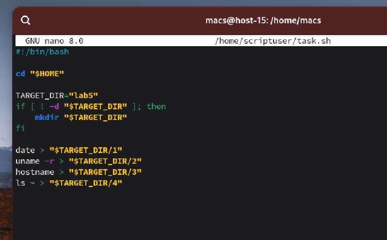

Изменили юнит, добавили новый путь изменив пользователя (забыл добавить скриншоты и стер терминал, там мы еще копировали файл из старой папки к новому пользователю для добавления в сам юнит и тд, а также установили новые права на выполнение файла с помощью scriptusser:scriptuser)

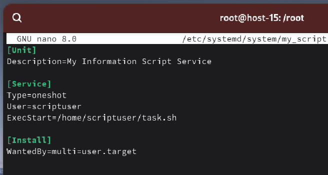

установили зависимости и запустили

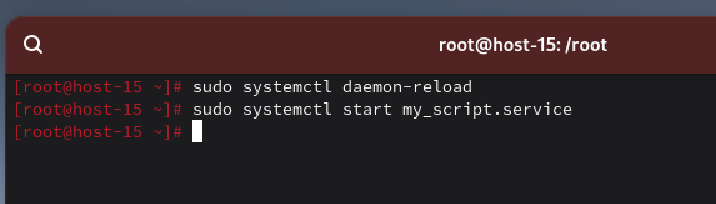