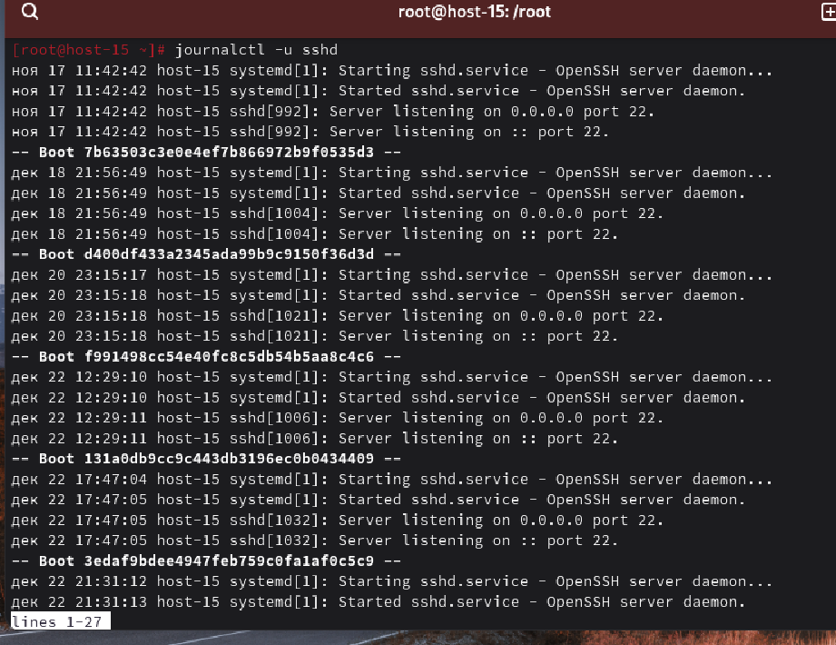
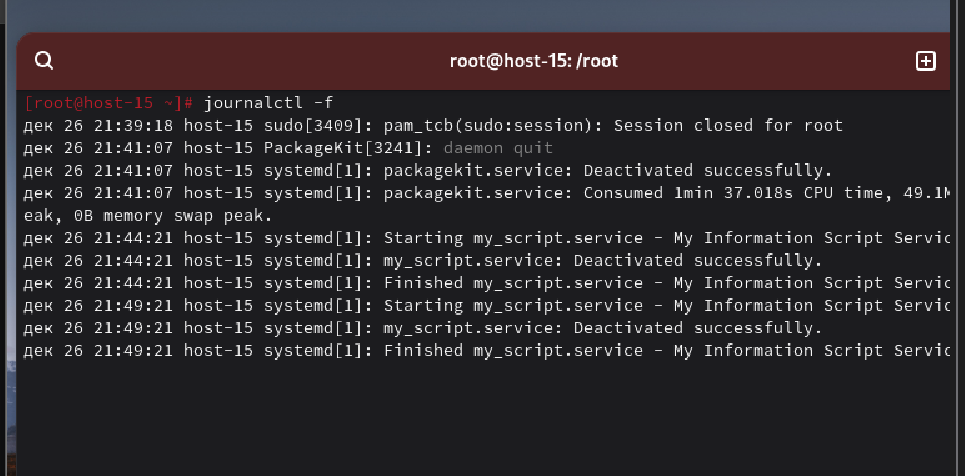
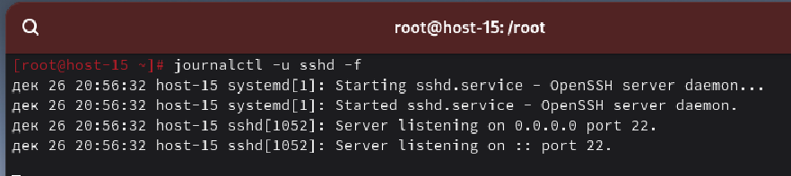

#### 1. Посмотретите журналы ssh

Посмотрим журнал sshd с помощью команды **journalctl -u**

#### 2. Выведите журналы в реальном времени

Для просмотра журналов в реальном времени воспользуемся флагом **-f** для команды **journal**

#### 3. Выведите лог в реальном времени для службы sshd

Для просмотра журналов в реальном времени допишем к программе из 1 пункта флаг **-f**

#### 4. Можно ли без комады journalctl прочитать логи systemd?

Да, но это сложно. Логи systemd-journald хранятся в бинарном (двоичном) формате в директории /var/log/journal/. Их нельзя просто открыть текстовым редактором вроде nano или cat. Однако есть способы их прочитать, например используя службу rsyslog, которая дублирует важные сообщения в обычные текстовые файлы.

#### 5. Сколько будет 2-2?

Почему все вопросы не могут быть такими((( 0 наверное..