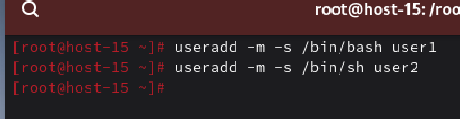
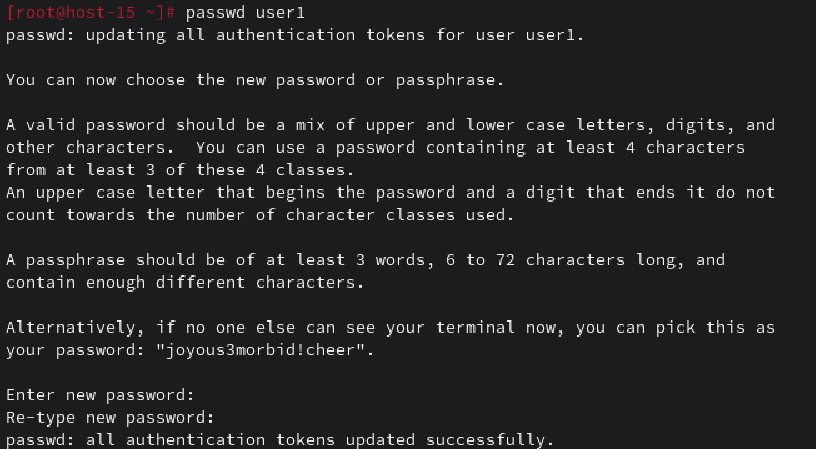
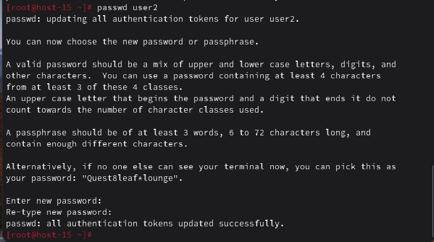
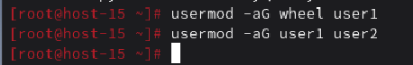
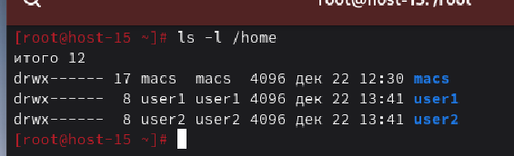
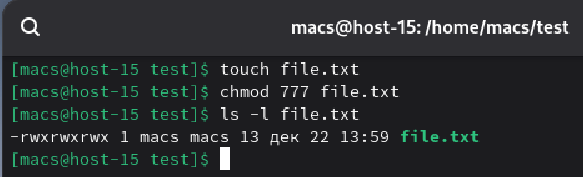
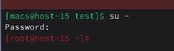
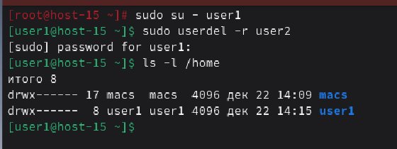
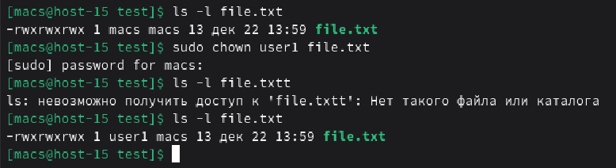

#### 1. Добавьте пользователей user1 и user2:
#####    1.1) user1 - оболочка bash
#####    1.2) user2 - оболочка sh
#####   1.3) установите им пароли

Для начала создали пользователей c помощью команды **useradd** и указанием оболочки

Далее установили пароли для каждого из пользователей с помощью команды **passwd** и указанием имени пользователя

#### 2. Назначьте пользователю 1 группу администраторов, польователя 2 добавте в группу пользователя 1

Для добавления пльзователей в группы воспользуемся командой **-aG**. Для начала добавим user1 в группу администраторов, для этого укажем wheel, затем добавим user2 в группу пользователя user1

#### 3. Что такое права доступа? Выведите права доступа на файлы в директории пользователя

**Права доступа** - это набор разрешений (чтение r, запись w, выполнение x), которые определяют, что можно делать с файлом

Для просмотра прав доступа воспользуемся командой **ls -l**

#### 4. Как изменить права на файлы? Создайте файл который будет на который у всез пользователей будут все возможные права

Права на файлы можно изменять с помощью команды **chmod**. Для создания файла, в котором у всех пользователей будут все возможные права, при применении команды **chmod** укажем числовой код **777**

#### 5. Как называется учётная запись встренного администратора в linux?

Учетная запись называется **root**

#### 6. Как выполнить команду от имени администратора?

Для выполнения команды от имени администратора необходимо переключиться на root. Для этого воспользуемся командой **su -**

#### 7. Есть ли ограничения у суперпользователя?

У суперпользователя практически нет ограничений в рамках ОС. Он может читать любые файлы и удалять системные компоненты. Ограничения могут быть только внешними (например, доступ «только для чтения» на уровне сетевого диска или физическая поломка железа)

#### 8. Удалите пользователя 2 с помощью пользователя 1.

Для удаления пользователя сначала перейдем на пользователя user1, а затем командой **userdel -r** удалим пользователя user2

#### 9. Как можно изменить владельца папки? измените владельца папки из пункта 4

Для изменения владельца воспользуемся командой **chown** с указанием пользователя и файла

