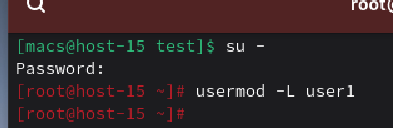
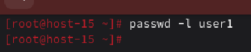
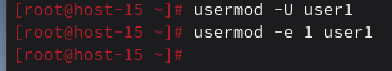
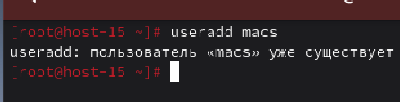

#### 1. Запретите пользователю user1 из предыдщуего задания выполнять вход в систему

Для того, чтобы запретить пользователю user1 выполнять вход в систему сначала перейдем в root, а затем воспользуемся командой **usermod -L**

#### 2. Как вы это сделали?

Я использовал команду usermod с ключом -L. Эта команда блокирует пароль пользователя, делая его невалидным для аутентификации. При этом все файлы пользователя и его настройки сохраняются, но войти в систему он не может

#### 3. Какие ещё способы это сделать вы знаете?

Для того, чтобы заблокировать пользователя можно также воспользовать блокировкой пароля с помощью команды **passwd -l**

Также можно воспользоваться истечением срока аккаунта. Для этого воспользуемся командой **usermod -e 1**. Данная команда устанавливает дату истечения учетной записи на 1970 год, из-за чего аккаунт мгновенно становится просроченным и неактивным.

#### 4. Можно ли создать пользователей с одинаковыми username?

Нет, нельзя создать пользователей с одинаковыми именами, так как в Linux имя пользователя является уникальным идентификатором в файле /etc/passwd

