#### 1. Переместиться между директориями

Команда cd позволяет переходить между директориями. Мы можем указывать абсолютные пути (начинающиеся с /) или относительные пути.

**Пример:**
Для примера предворительно создали папку тест с помощью команды **mkdir**
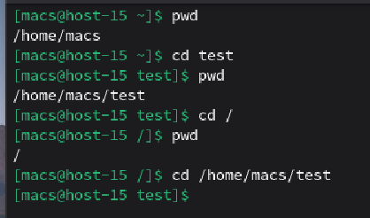

#### 2. Вывести список файлов в директории

Для начала с помощью команды **touch** создадим 3 файла, **file1.txt**, **file2.txt** и **file3.txt**. Далее с помощью команды **ls** выведем весь список файлов дирректории **test**
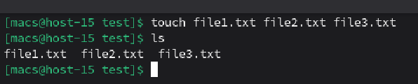

#### 3. Вывести список Всех файлов в директории
Для вывода всех файлов директории будем использовать команду **ls -l**
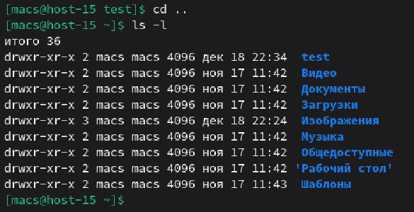

#### 4. Создать папку с подпапками

Для создания подпапки с папками воспользуемся сначала командой **cd** для перехода на уровень ниже, а затем **mkdir** для создания директории
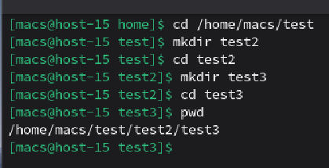

#### 5. Внутри папки создать файлик и записать в него что-нибудь

Создадим в папке test3 файл **text.txt** с помощью команды **touch**, далее заполним файл данными используя команду **echo**
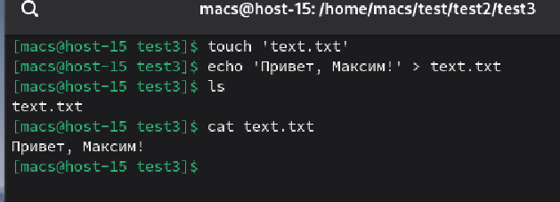
С помощью команды **cat** посмотрим содержимое файла

#### 6. Переместить файл из одной директории в другую

С помощью команды **mv** переместим файл text.txt из папки test3 в папку test2
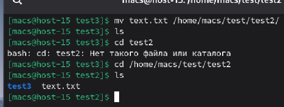

#### 7. Скопировать файл из одной директории в другую

Для копирования файла из одной директории в другую воспользуемся командой **cp**. Копируем файл text.txt из директории test2 в директорию test

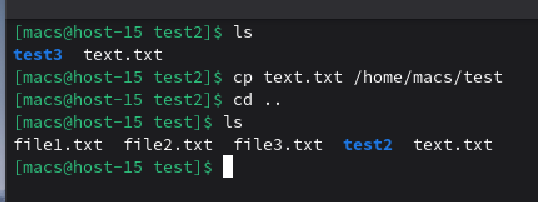

#### 8. Переименовать файл

Для того, чтобы переименовать файл text.txt в файл change.txt воспользуемся командой **mv**

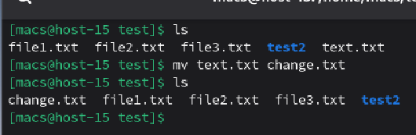

#### 9. Сравнить содержимое файла

Для сравнения файлов создадим файл **change2.txt** и воспользуемся командой **diff**

**Пример:**
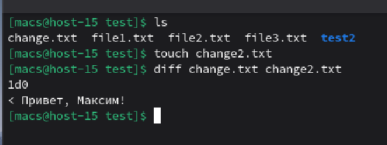

На примере видно, что при сравнении файл change.txt оказался большим, так как содержит строку **'Привет, Максим!'**

#### 10. Отсортировать содержимоей файла по возрастанию и убыванию

Имеем файл **unsorted.txt** изначально заполненный неотсортированными строками. 

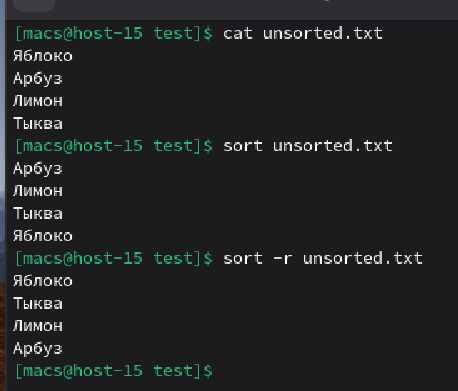

Для сортировки по возрастанию используем команду **sort**, а для сортировки по убыванию воспользуемся командой **sort** с параметром **-r**

#### 11. Удалить все папки и файлы
Для того, чтобы удалить все папки и файлы созданный до этого мы воспользуемся несколькими командами:
1. **rm** - для удаления файла
2. **rmdir** - для удаления дирректории
3. **rm -rf** - для удаления дирректории со всем ее содержимым

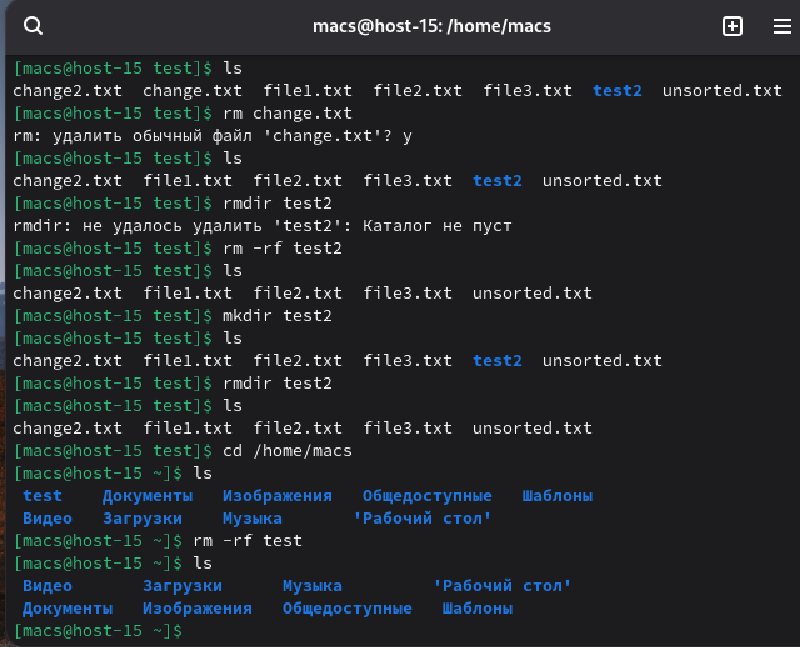