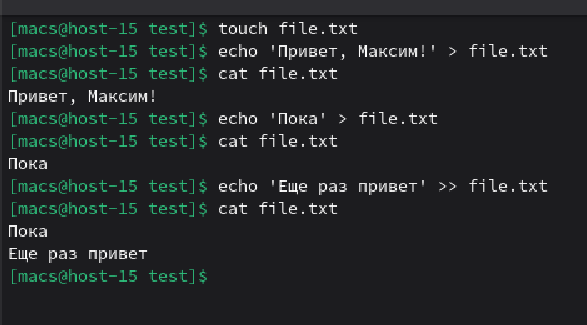
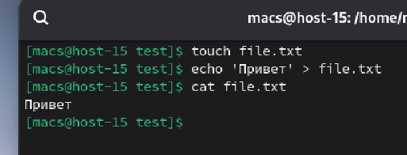
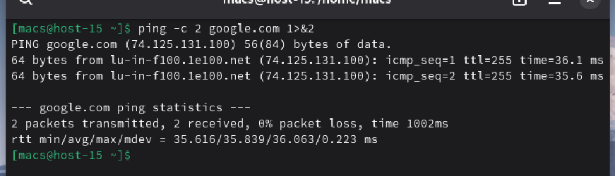
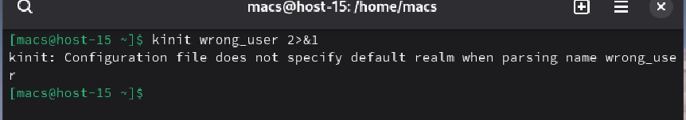
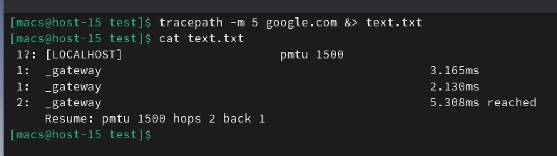
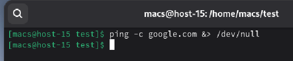

#### 1. Как работают команды >,>>?

Команды **>** и **>>** работают для записи информации в файл, но отличаются друг от друга тем, что:
**>** - перезаписывает файл
**>>** - дописывает в конец файла

#### 2. Что такое перенаправление ввода? stderr,stdout;

**Перенаправление ввода** - это механизм командной оболочки, который позволяет изменить источник данных для программы (например вместо клавиатуры программа будет читать данные из файла)

**stderr** - стандартный поток вывода ошибок и отладочных сообщений, которые можно перенаправлять в другой файл, не затрагивая основной вывод

**stdout** - стандартный поток вывода (в файл или на экран)

#### 3. Вывести содержание файла не используя текстовые редакторы

Для того, чтобы вывести сожержимое файла воспользуемся командой **cat**

#### 4. Создать файл с содержимым не используя текстовые редактор

Для создания файла воспользуемся командой **touch** для создания файла и командой **echo** для заполнения файла

#### 5. Пернеаправить stdout в stderr и обратно на примере команды kinit, ping, tracert
 
 1. На примере ping перенаправим stdout в stderr. Для этого воспользуемся конструктором **1>&2**, где **1** - это stdout, **2** - это stderr, а **>&** - сам конструктор перенаправления

 

 2. На примере kinit наоборот перенаправим stderr в stdout. Для этого воспользуемся похожим конструктором но поменяем местами 1 и 2

 

 3. Также в Linux есть возможность направить оба потока в 1 место, например удачное выполнение команды будет выводиться в файл, и ошибки будут также выводиться в файл, для этого воспользуемся конструкцией &>. Так как команда traceroute не установлена изначально, для примера воспользуемся командой tracepath, выполняющей те же функции, что и traceroute

 

#### 6. Чем отличаются stdout и stderr?

**stdout** отличается от **stderr** тем, что **stdout** используется для нормального вывода программы: результаты работы, данные, основная информация. **stderr** используется для диагностических сообщений: ошибки, предупреждения, отладочная информация

#### 7. Что такое stdin?

**stdin** - стандартный поток ввода данных, который программа использует для получения информации, по умолчанию с клавиатуры, но можно перенаправить, например для получения данных из файла

#### 8. Как отправить весь вывод команды в пустоту?

Для отправления всегода вывода команды в пустоты используется так называемый пустой файл /dev/null. Команда выполнилась, но результат ее никуда не сохранился, но если команда выполняется с ошибкой, то ошибка все равно выводится на экран

